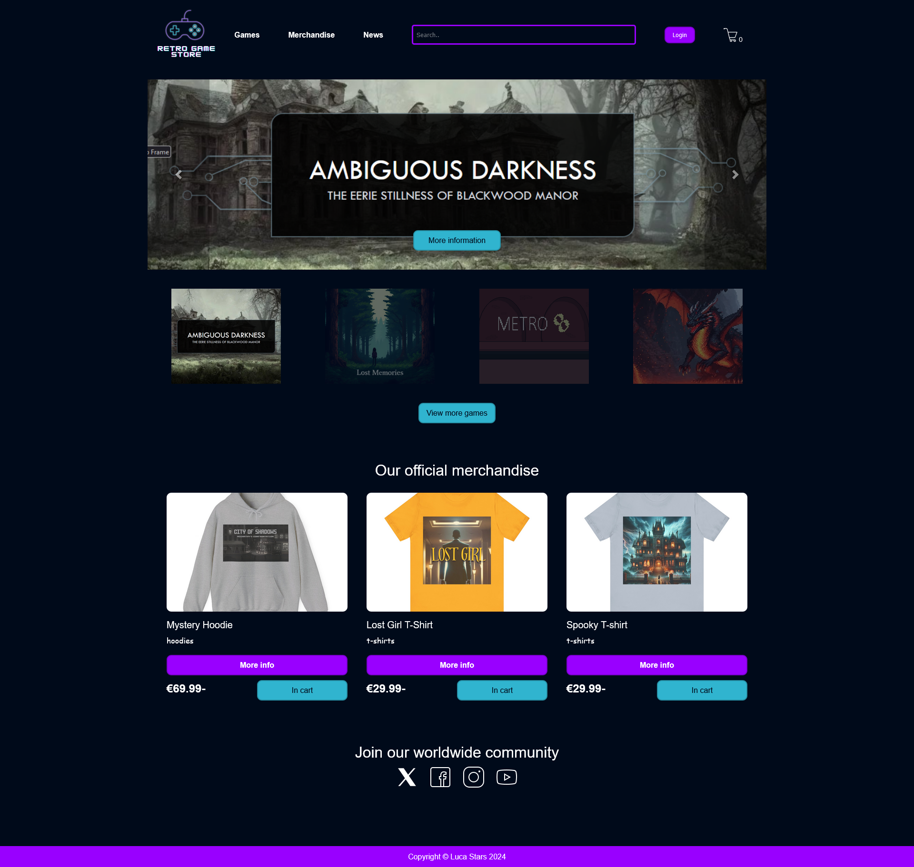
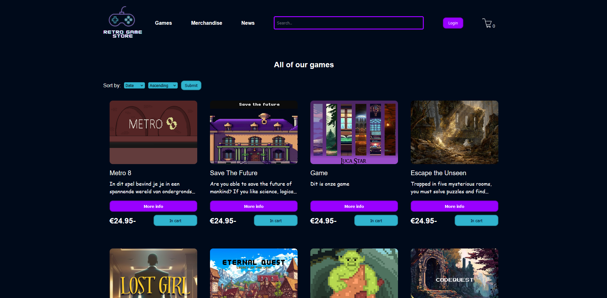
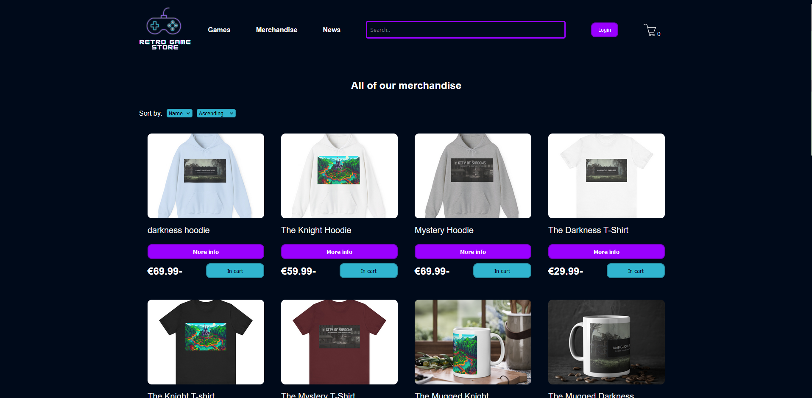
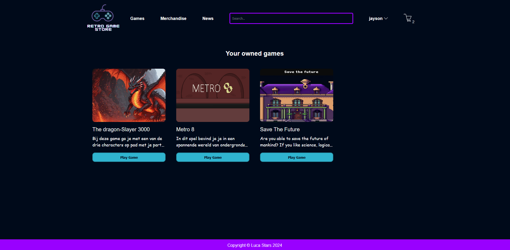
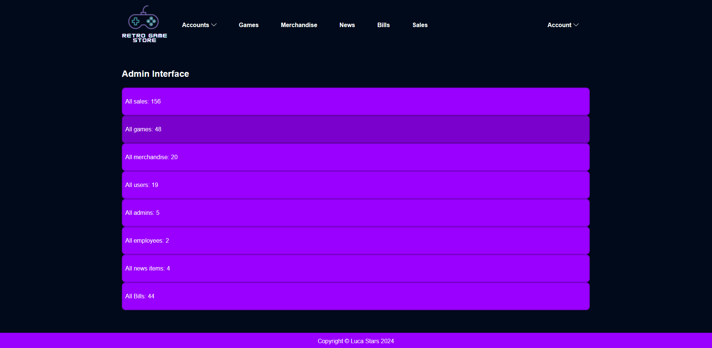

# LucaStars webshop
A responsive webshop for text based adventure games and merchandise. 

## Table of Contents
* [Indtroduction](#introduction)
* [Preview](#preview)
* [Installation](#installation)
* [Contact](#contact)

## Introduction
This project is a sleek, responsive e-commerce site built for selling interactive text adventure games. It leverages modern web technologies like TypeScript for coding, Express.js for backend services, and Lit for crafting reusable web components, ensuring a smooth and engaging user experience. The purpose is to create an effortless way for users to discover, browse, and purchase games, featuring options such as detailed game descriptions, a shopping cart, and a checkout process.

The project illustrates strong full-stack development abilities, with an emphasis on creating a modular and scalable structure, along with efficient API route management.

## Preview
### Homepage


### Games overview


### Merchandise overview


### Library


### Admin interface



## Installation

### Installing the project 
```
git clone https://github.com/Jayson-1307/Game-webshop.git
cd game-webshop
npm install
```

### Running the project
#### If u want to run both the Front- and Backend:
run this command in the terminal: 
```
npm run dev
```
this will run both the Front- and backend

#### Or if u want to run the Front- and backend seperately
In two seperate terminals, run the following commands: 

**API**
```
npm run dev -w src/api
```

**Web**
```
npm run dev - w src/web
```

Open 'localhost:3000' in your browser, and the webshop should be shown!

## Contact
If you have any questions or saw something interesting, feel free to contact me!    
u can send me an email: jvanolffen@outlook.com or send me a direct message on [LinkedIn](https://www.linkedin.com/in/jayson-van-olffen/)! 


