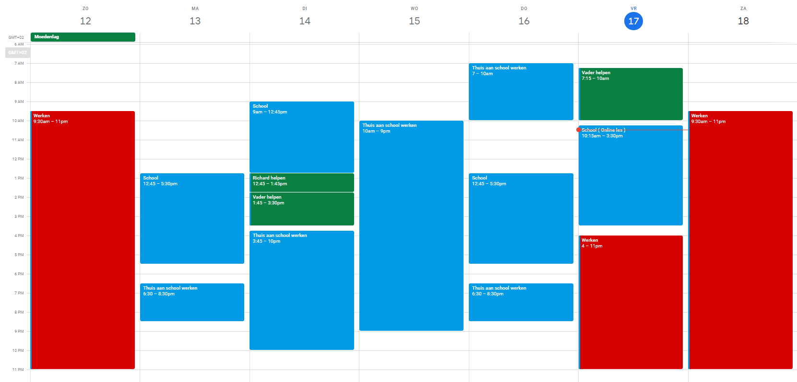

> ## Coach ( Sprint 2 )
>
> Naam: Gurpreet Singh  
> Datum: 15-5-2024
> 
> ---
> 
> ## Inleiding
> 
> In mijn vorige verslag heb ik mijn leerdoel gesteld om beter te leren plannen en organiseren. Ik heb erkend dat dit me zal helpen om mijn werk efficiënter te maken en minder gestrest te voelen. Ik heb vastgesteld dat ik digitale tools zou gebruiken, realistische doelen en regelmatige evaluatie zal gebruiken om dit te bereiken.
> 
> ---
> 
> ### Terugblik op vorige coach gesprek ( Sprint 1 )
> 
> In mijn vorige verslag heb ik mijn leerdoel gesteld om beter te leren plannen en organiseren. Ik heb erkend dat dit me zal helpen om mijn werk efficiënter te maken en minder gestrest te voelen. Ik heb vastgesteld dat ik digitale tools zou gebruiken, realistische doelen en regelmatige evaluatie zal gebruiken om dit te bereiken.
> 
> ---
> 
> ### Aanpak
> 
> 1. **Gebruik van Google Calendar**: Ik heb mijn planning bijgehouden in Google Calendar. Dit heeft me geholpen om een overzicht te krijgen van mijn taken en afspraken, zodat ik mijn tijd beter kon indelen en conflicten kon vermijden. Ook kan ik terugkijken naar wat ik de vorige dagen heb gedaan, wat vooral handig is voor iemand zoals ik, die meestal druk is met werk en soms vergeetachtig kan zijn.
>
> 2. **Stellen van realistische doelen**: Ik heb mijzelf realistische doelen gesteld en bedacht hoe ik deze kon bereiken. Door mijn taken in stukken op te delen, kon ik mijn doelen gemakkelijker behalen en mijn vooruitgang bijhouden.
>
> 3. **Regelmatige evaluatie**: Ik heb regelmatig mijn planning geëvalueerd om te zien of deze nog steeds relevant en haalbaar was. Als dat nodig was, heb ik mijn plannen aangepast om beter aan te sluiten bij mijn behoeften en prioriteiten.
> 
> ---
> 
> ## Bewijs
> 
> 
> ---
> 
> ## Conclusie
> 
> Door mijn leerdoel serieus te nemen en actief te werken aan beter plannen en organiseren, heb ik gemerkt dat ik mijn werk efficiënter kan maken en minder gestrest ben. Het gebruik van digitale tools, zoals Google Calendar, heeft mij geholpen om mijn tijd effectiever te beheren en mijn doelen te bereiken. Ik ben van plan om deze aanpak voort te zetten en mijn vaardigheden op dit gebied verder te ontwikkelen.
