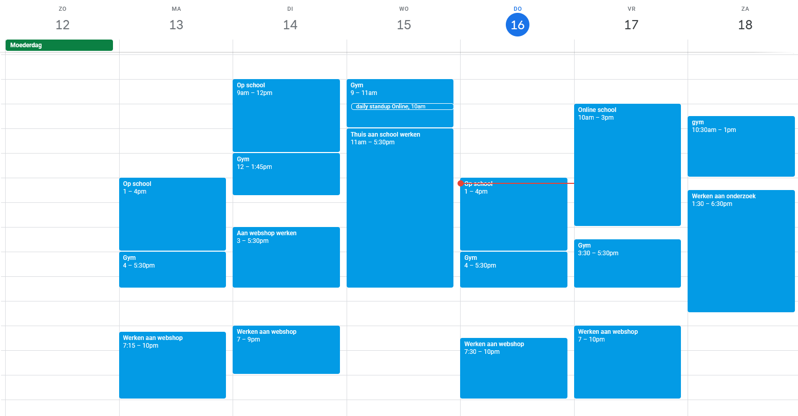

# Voortgang leerdoel

## Hoe heb ik het aangepakt? 
De Laatste tijd ben ik begonnen met mijn dagen inplannen met behulp van online tools. Eerst gebruikte ik ClickUp, maar uiteindelijk ben ik over gestapt naar google calendar. De reden dat ik was overgestapt, is dat ik google calender een makkelijkere en overzichelijkere tool vind. Ik was het ook al gewend te gebruiken, aangezien ik dit bij mijn stage vorig jaar ook moest gebruiken. Ik heb daarmee mijn dagen ingedeeld, niet inspecifieke taken, maar in waaraan ik mijn tijd ga besteden. Hieronder zal ik een voorbeeld laten zien. Ik heb de standaard dingen, zoals tijden dat ik op school moet zijn op herhalen gezet. De andere dingen zoals wanneer ik in mijn vrije tijd aan school werk, plan ik elke week op maandag in.  

 

## Hoe is dit bevallen?
Alhoewel ik me er nog niet constand 100% aan hielt, heeft het wel al heel erg geholpen. Het bleef automatisch in mijn achterhoofd zitten, waardoor ik me er onbewust wel aan ging houden. Ik ga dit in de toekomst nog wel verder blijven gebruiken, ook voor zaken buiten school. Het biedt veel overzicht en zo vergeet ik ook niet wanneer ik wat te doen heb. 

