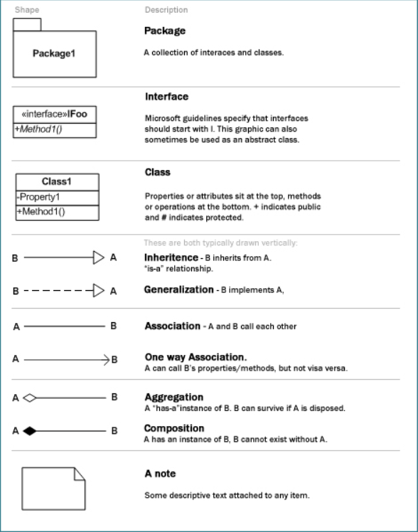

# Expert review sprint 1

## Inhoudsopgave
- [Inleiding](#inleiding)
- [Database](#databse)
- [UML class diagram](#uml-class-diagram)
- [Acceptatie criteria](#acceptatie-criteria)
- [Feedback (na presentatie)](#feedback-na-presentatie)

## Inleiding
In dit bestand is te zien wat wij hebben gemaakt om op te leveren voor onze expert review. Dit bevat zoals hier boven te zien een gedeelte over ons design voor de database (een EERD), een UML class diagram, en we zullen langs onze user stories lopen om te kijken of onze acceptatie criteria voldoen aan de eisen.
    

## Databse
### Inhoud
Bekijk hieronder onze EERD:
   

### Bronnen
- https://knowledgebase.hbo-ict-hva.nl/1_beroepstaken/software/ontwerpen/relationele_databases/eerd/
- https://www.linkedin.com/learning/programming-foundations-databases-2
    

## UML class diagram
### inhoud
Bekijk hier onze UML class diagram:
[UML class diagram](../../architecture-document/uml_v8.uxf).     
   

### Legenda
   

### Bronnen
- https://www.javatpoint.com/uml-class-diagram
- https://knowledgebase.hbo-ict-hva.nl/1_beroepstaken/software/ontwerpen/uml/uml_class_diagram/   
     

## Acceptatie criteria
### Inhoud
Hier is een link naar onze issue boards in gitlab: [Onze gitlab issue boards](https://gitlab.fdmci.hva.nl/propedeuse-hbo-ict/onderwijs/2023-2024/out-d-se-gd/blok-4/goocaanuuzoo59/-/boards/19690). De issues met de tag "zelfgemaakt" zijn zoals het ook omschrijft, zelfgemaakt door ons. Dit brengt iets meer overzicht. 

### Bronnen
- [https://gitlab.fdmci.hva.nl/propedeuse-hbo-ict/onderwijs/2023-2024/out-d-se-gd/blok-4/goocaanuuzoo59/-/issues/24](https://gitlab.fdmci.hva.nl/propedeuse-hbo-ict/onderwijs/2023-2024/out-d-se-gd/blok-4/goocaanuuzoo59/-/issues/24)
- [https://agilescrumgroup.nl/acceptatiecriteria/](https://agilescrumgroup.nl/acceptatiecriteria/)
     

## Feedback (na presentatie)
### EERD: 
- 1 Tabel voor profile en user.
- Gender schrappen in profile/user.
- offer datum toevoegen.
- merchandise type aparte tabel. 
- genre een enum of aparte tabel maken. 
- type weghalen uit game tabel
- kijken om user id te ontbinden met bill/order, zodat die niet worden verwijderd. 
- "quantity" veranderen naar "inStock"

### UML class diagram
- Userdata "?" weg bij authorization level.
- Products class toevoegen
- Verder zoeken naar belangrijke missende classes. 
