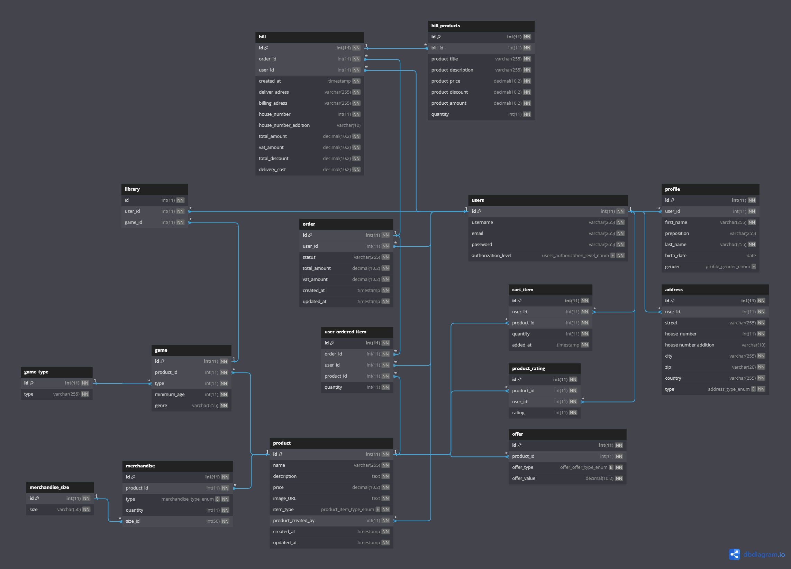

# Product review sprint 1

## Inhoud
- [Inleiding](#inleiding)
- [Ons design](#ons-design)
- [Design document](#design-document)
- [Guerilla test](#guerilla-test)
- [Database/EERD](#databaseeerd)
- [Issue board](#issue-board)

## Inleiding
In dit bestand zullen we een kijkje gaan nemen naar wat wij tot nu toe kunnen opleveren voor onze webshop genaamd: RetroGameStore. We hebben een design gemaakt en hierbij een design document. Daarnaast zullen we even kijken naar hoe wij onze database hebben ingedeeld en we van plan zijn om alle data hierin op te slaan. Als laatst gaan we kijken naar de user stories die wij hebben gemaakt voor dit project tot zover. 

## Ons design
Ons design is te zien in figma. [Klik hier om ons figma design te bekijken](https://www.figma.com/file/WfgMc5l99lvrNnlmleKivO/Figma-RGS?type=design&node-id=28%3A753&mode=dev&t=j8TieU09f4JFwlTR-1).

## Design document
Bijbehorend aan het hiervoor meegegeven design, hebben wij ook een design document. [Die kunt u hier bekijken.](https://docs.google.com/document/d/10jEY4yG4iIPpDj8W8Sq9oLl3pAQhkxm-zfgFTPffFEA/edit?usp=sharing)

## Guerilla test
Ook hebben we voor het design een guerilla test uitgevoerd. Dit hebben we gedaan zodat we voordat we echt volop gaan developen, nog wat wensen van onze doelgroep kunnen verwerken in ons design. [Bekijk de guerilla test uitslagen hier.](./tests-sprint-1.md)

## Database/EERD

## Issue board
We gaan nu kijken naar ons issue board. Al onze zelfgemaakte issues hebben een custom-tag genaamd "zelfgemaakt". Er zullen er hier ongetwijfeld nog extra issues aan toegevoegd worden met de tijd. [Bekijk hier ons issue board](https://gitlab.fdmci.hva.nl/propedeuse-hbo-ict/onderwijs/2023-2024/out-d-se-gd/blok-4/goocaanuuzoo59/-/boards/19690).