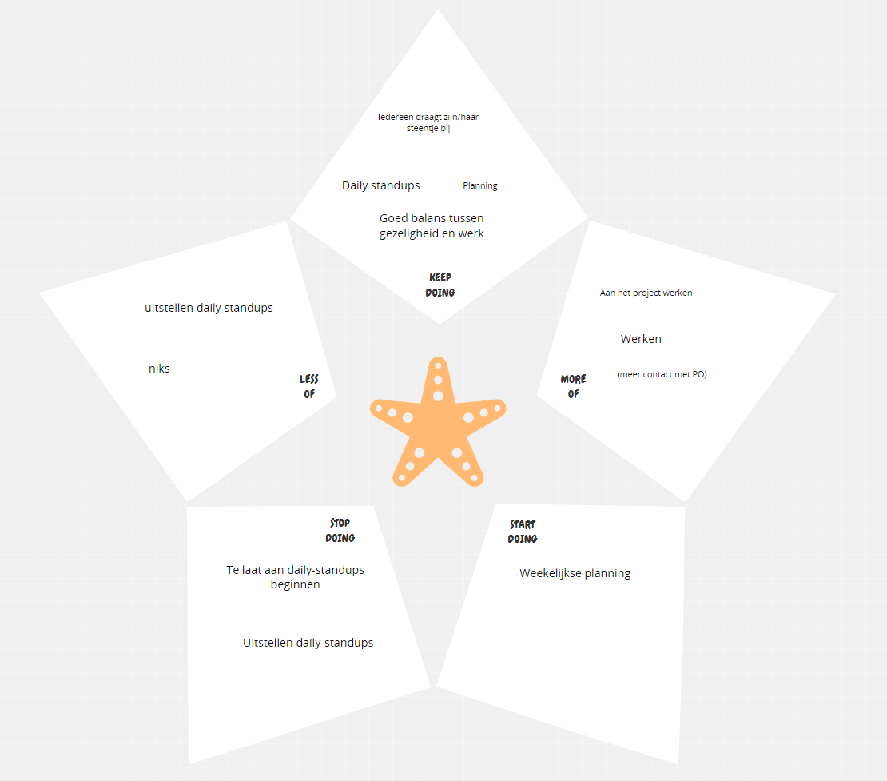

# Retro sprint 1

## Starfish

### Wat gaan we blijven doen
Alleen bij dit onderdeel was er echt verschil in onze antwoorden. Het zijn allemaal punten waar we het allemaal mee eens zijn. 

### Wat gaan we minder doen
We zijn het er allemaal over eens dat we minder de daily standups moeten uitstellen elke dag. Om dit te voorkomen, gaan we een wekelijks schema maken met tijden waarop wij op elke werkdag de daily gaan doen. Wij denken dat als we een tijd per dag vaststellen, er meet consistentie komt aangezien het deel van onze routine word.

### Wat gaan we meer doen
We hadden allemaal opgeschreven dat we meer willen werken aan het project. Hiermee bedoelen we niet dat we nu niet goed werken, maar dit was meer de design fase. Hierdoor waren we eigenlijk meer bezig met dingen bedenken en minder bezig in de praktijk. Volgende sprints willen we dus er op letten dat we wel goed aan het werk gaan in de praktijk.

### Waarmee gaan we stoppen
Dit is eigenlijk het zelfde als wat we minder willen gaan doen. We willen stoppen met telaat de daily standups doen, zodat er meer consistentie is. De daily standups optijd doen geeft elkaar inzicht van wat we gaan doen die dag, en dat brengt orde. Hierbij willen we dezelfde actie als bij "Wat gaan we minder doen" ondernemen.

### Waarmee gaan we beginnen
We willen wekelijks een planning gaan maken met zijn alle, zodat we een overzicht hebben van de dingen die belangrijk zijn om die week te behandelen. Op die manier komen we nooit zonder iets te doen, en houden we structuur in onze werk wijze. Dit zal zorgen voor een stabiele voortgang binnen het project.
 

## Feedback voor elkaar op basis van gedrag
### Hele groepje
#### Tops
- Gezellig wanneer het kan
- Goede communicatie

#### Tips
- Wekelijke planning gaan maken, voor meer overzicht.
- Sneller user stories aanmaken (niet te lang mee wachten).

### Aydin 
#### Tops
- Goed balans tussen Gezelligheid en werken. 
- Was goed betrokken. (Jayson zat samen met Aydin vorig blok, en merkte hierin een groot verschil). Aydin werkte overal aan mee, en was zelf ook al bezig met wat dingen designen voor op in de webshop. 

#### Tips
- Tot zover nog geen, alles gaat tot nu toe goed. Er is goede communicatie binnen het team, er zijn nog geen conflicten geweest, iedereen doet zijn werk en we zijn open naar elkaar. We zijn natuurlijk pas 2 weken bezig, en vooral in een design fase, dus voor nu kunnen we nog geen tips voor elkaar bedenken. In de komende sprints zal dit geheid nog ontstaan.

### Bart 
#### Tops
- Nam goed initiatief (organisatie en ideeën). Bart liet al vroeg zien dat hij graag dingen op zich wou nemen om zo het werk beter te verdelen. Vooral het georganiseerd houden van de ideeën en deze ook uitwerken in een design document. 
- Goed balans tussen Gezelligheid en werken.

#### Tips
- Tot zover nog geen, alles gaat tot nu toe goed. Er is goede communicatie binnen het team, er zijn nog geen conflicten geweest, iedereen doet zijn werk en we zijn open naar elkaar. We zijn natuurlijk pas 2 weken bezig, en vooral in een design fase, dus voor nu kunnen we nog geen tips voor elkaar bedenken. In de komende sprints zal dit geheid nog ontstaan.

### Gurpreet 
#### Tops
- Nam veel initatief (Databse en issueboard). Terwijl het hele groepje veel bezig was met het design en ideeën voor de website, heeft gurpreet het ontwerpen en maken van de database op zich genomen. Daarnaast heeft hij veel user stories aangemaakt voor het project. 
- Goed balans tussen Gezelligheid en werken.

#### Tips
- Tot zover nog geen, alles gaat tot nu toe goed. Er is goede communicatie binnen het team, er zijn nog geen conflicten geweest, iedereen doet zijn werk en we zijn open naar elkaar. We zijn natuurlijk pas 2 weken bezig, en vooral in een design fase, dus voor nu kunnen we nog geen tips voor elkaar bedenken. In de komende sprints zal dit geheid nog ontstaan.

### Jayson 
#### Tops
- Nam veel initiatief (Design en Samenwerking). Jayson nam het sleeptouw in het designen van de webshop, maar ontving hierbij nogsteeds hulp van de andere. Daarnaast nam hij een grote rol in het zorgen voor een goede samenwerking binnen het team.  
- Goed balans tussen Gezelligheid en werken.

#### Tips
- Tot zover nog geen, alles gaat tot nu toe goed. Er is goede communicatie binnen het team, er zijn nog geen conflicten geweest, iedereen doet zijn werk en we zijn open naar elkaar. We zijn natuurlijk pas 2 weken bezig, en vooral in een design fase, dus voor nu kunnen we nog geen tips voor elkaar bedenken. In de komende sprints zal dit geheid nog ontstaan.