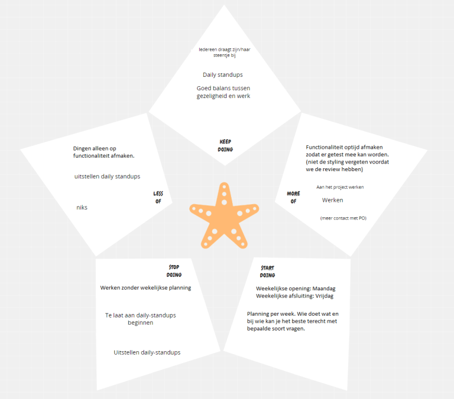
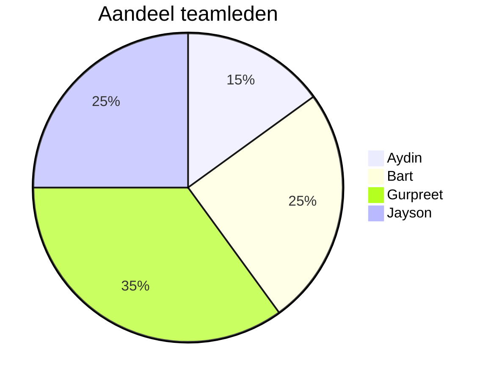

# Retro sprint 2

## Starfish

### Wat gaan we blijven doen
Alleen bij dit onderdeel was er echt verschil in onze antwoorden. Het zijn allemaal punten waar we het allemaal mee eens zijn. 

### Wat gaan we minder doen
We zijn het er allemaal over eens dat we minder de daily standups moeten uitstellen. Om dit te voorkomen, gaan we een wekelijks schema maken met tijden waarop wij elke werkdag de daily standup doen. Wij denken dat als we een tijd per dag vaststellen, er meer consistentie komt aangezien het deel van onze routine wordt. Ook is er feedback gekomen vanuit de PO dat wij meer het hele proces moeten afronden, niet alleen zoveel mogelijk functionaliteit. Hij had liever dat we meteen een afgeronde functie afleverden.

### Wat gaan we meer doen
We hadden allemaal opgeschreven dat we meer willen werken aan het project. Hiermee bedoelen we niet dat we nu niet goed werken, maar dat we meer in de praktijk willen werken in plaats van alleen in de designfase. Volgende sprints willen we er dus op letten dat we goed aan het werk gaan in de praktijk. We gaan meer focussen op de functionaliteit zodat testen op tijd af zijn, zodat wij de testen volledig kunnen afleggen.

### Waarmee gaan we stoppen
Dit is eigenlijk hetzelfde als wat we minder willen doen. We willen stoppen met het te laat doen van de daily standups, zodat er meer consistentie is. De daily standups op tijd doen geeft inzicht in wat we die dag gaan doen, en dat brengt orde. Hierbij willen we dezelfde actie als bij "Wat gaan we minder doen" ondernemen. We willen stoppen met werken zonder schema en dit veranderen door middel van een wekelijkse planning.

### Waarmee gaan we beginnen
We willen wekelijks een planning maken met zijn allen, zodat we een overzicht hebben van de belangrijke dingen voor die week. Op die manier komen we nooit zonder iets te doen te zitten, en houden we structuur in onze werkwijze. Dit zal zorgen voor een stabiele voortgang binnen het project. We gaan Google Calendar gebruiken om weken te plannen, en hierbij maandag de week starten en vrijdag de week afsluiten.
 

## Verschillen tussen Sprint 1 en Sprint 2

#### Wat gaan we blijven doen
- **Sprint 1:** 
  - Alleen bij dit onderdeel was er echt verschil in onze antwoorden. Het zijn allemaal punten waar we het allemaal mee eens zijn.
  - **Is het in Sprint 1 gelukt?**: 
    - Ja, iedereen was goed op weg in sprint 1.
- **Sprint 2:** 
  - Wederzijdse ondersteuning en kwaliteitsbewaking.

#### Wat gaan we minder doen
- **Sprint 1:** 
  - Daily standups minder uitstellen door een wekelijks schema te maken. Wij denken dat als we een tijd per dag vaststellen, er meer consistentie komt aangezien het deel van onze routine wordt.
  - **Is het in Sprint 1 gelukt?**: 
    - Nee, de daily standups zijn niet altijd op tijd gedaan. We hielden wel bij in de klas waar iedereen mee bezig was, en realiseerden ons hoe belangrijk het is om te weten hoever iedereen is met zijn eigen onderdeel.
- **Sprint 2:** 
  - Daily standups minder uitstellen door een wekelijks schema te maken.
  - Meer focus op het afronden van het hele proces in plaats van alleen functionaliteit, zoals voorgesteld door de PO.

#### Wat gaan we meer doen
- **Sprint 1:** 
  - Meer willen werken aan het project. Hiermee bedoelen we dat we meer praktisch bezig willen zijn in plaats van alleen in de designfase.
  - **Is het in Sprint 1 gelukt?**: 
    - Ja, we hebben veel aan het project gewerkt, hoewel het soms te veel in bulk en met te weinig structuur was.
- **Sprint 2:** 
  - Meer tijd besteden aan praktische werkzaamheden in plaats van alleen designfase.
  - Meer focus op tijdige afronding van functionaliteit voor testen.

#### Waarmee gaan we stoppen
- **Sprint 1:** 
  - Te laat doen van de daily standups om meer consistentie te brengen. De daily standups op tijd doen geeft inzicht in wat we die dag gaan doen, en dat brengt orde.
  - **Is het in Sprint 1 gelukt?**: 
    - Nee, het is niet altijd gelukt om de daily standups op tijd te doen. We hielden wel bij waar iedereen mee bezig was en beseften hoe belangrijk het is om te weten hoever iedereen is met zijn eigen taken.
- **Sprint 2:** 
  - Te laat doen van daily standups om meer consistentie en orde te brengen.
  - Werken zonder een schema, dit willen we veranderen door middel van een wekelijkse planning.

#### Waarmee gaan we beginnen
- **Sprint 1:** 
  - Wekelijks een planning maken met zijn allen, zodat we een overzicht hebben van de belangrijke dingen voor die week. Dit zal zorgen voor een stabiele voortgang binnen het project.
  - **Is het in Sprint 1 gelukt?**: 
    - Nee, we hadden wel deels een plan, maar niet iets concreets. Dit is een punt waar we volgende sprint echt op willen hameren.
- **Sprint 2:** 
  - Wekelijks gezamenlijk een planning maken om overzicht te houden van belangrijke zaken.
  - Gebruik van Google Calendar om weken te plannen en structuur in de werkwijze te behouden.

### Conclusie
Sprint 2 functioneert in het verlengde van Sprint 1 maar legt extra focus op procesafronding en praktische uitvoering. Daarnaast introduceert Sprint 2 het gebruik van Google Calendar voor betere planning en structuur.

## Pie chart   

### Toelichting op pie chart:
Over het algemeen heeft iedereen wel goed gewerkt aan zijn deel. Toch heeft gurpreet wel echt het meest opgepakt. Al vanaf het begin van het blok begon gurpreet met taken oppakken en efficient afronden. Verder heeft iedereen gewoon gewerkt aan zijn deel. We hebben deze pie chart gebasseerd op hoeveel de persoon af heeft gemaakt, niet op de weight van user stories, omdat we dit eigenlijk niet hebben besproken. 

## Feedback voor elkaar op basis van gedrag
### Hele groepje
#### Tops
- Gezellig wanneer het kan
- Goede communicatie

#### Tips
- Vrijdag voor product review, even door het product heen lopen, zodat we kunnen zien hoe we er over het algemeen voor staan. 
- Als je lange ergens bij vast loopt, meld het aan het team. 
- In de toekomst wekelijkse planning maken. 

### Aydin 
#### Tops
- Goed balans tussen Gezelligheid en werken. 
- Was goed betrokken. (Jayson zat samen met Aydin vorig blok, en merkte hierin een groot verschil). Aydin werkte overal aan mee, en was zelf ook al bezig met wat dingen designen voor op in de webshop. 

#### Tips
- Optijd opstaan. Al 2 belangrijke reviews gemist. 

### Bart 
#### Tops
- Nam goed initiatief (organisatie en ideeën). Bart liet al vroeg zien dat hij graag dingen op zich wou nemen om zo het werk beter te verdelen. Vooral het georganiseerd houden van de ideeën en deze ook uitwerken in een design document. 
- Goed balans tussen Gezelligheid en werken.

#### Tips
- Als je lange ergens bij vast loopt, meld het aan het team. 

### Gurpreet 
#### Tops
- Nam veel initatief (Databse en issueboard). Terwijl het hele groepje veel bezig was met het design en ideeën voor de website, heeft gurpreet het ontwerpen en maken van de database op zich genomen. Daarnaast heeft hij veel user stories aangemaakt voor het project. 
- Goed balans tussen Gezelligheid en werken.
- Harde werker

#### Tips
- Geen, heeft tot zover heel hard gewerkt, goed gecommuniceert en is erg behulpzaam geweest.

### Jayson 
#### Tops
- Nam veel initiatief (Design en Samenwerking). Jayson nam het sleeptouw in het designen van de webshop, maar ontving hierbij nogsteeds hulp van de andere. Daarnaast nam hij een grote rol in het zorgen voor een goede samenwerking binnen het team.  
- Goed balans tussen Gezelligheid en werken.

#### Tips
- Meer focussen op backend in de toekomst. 