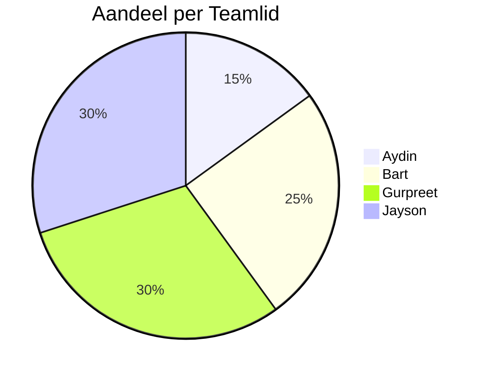
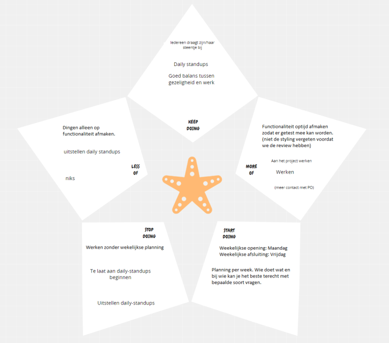

# Retrospective sprint 3

## Aandeel teamleden

**Aydin:**   
De reden dat ik deze sprint net zoveel heb gedaan als vorige keer is, omdat ik moeite had met sommige functionaliteiten en toen ik dacht dat het te lang zou duren heb ik gevraagd of iemand het kon overnemen en ging ik dus hele tijd van functionaliteit naar functionaliteit tot dat ik iets af kreeg en vanaf daar ging het wat beter en had nog een paar functionaliteiten af voor het einde van de sprint.

**Bart:**
Ik ben deze sprint op 25% gebleven. In de sprint planning heb ik een deel van de taken van de admin page gekregen. Ik heb deze taken voltooid. Uit de evaluatie kwam naar voren dat ik 25% van het werk heb gedaan.

**Gurpreet:**
Ik ben deze sprint van 35% naar 30% gegaan, niet omdat ik minder heb gedaan, maar andere hebben gewoon meer gedaan dan vorige sprint. Ik heb naar mijn- en andere hun mening nogsteeds hard en bovengemiddeld gewerkt

Jayson:
Ik ben deze sprint vanaf 25% omhoog gegaan naar 30%, omdat ik nog meer ben gaan doen dan vorige sprint. Hierdoor heb ik naar iedereens mening meer gedaan dan het "eerlijke" aandeel van 25%. Ik heb deze sprint meer gefocust op de backend en nogmeer tijd gestoken in het project, waardoor mijn percentage omhoog is gegaan. 

 

## Vorige Starfish

## Nieuwe starfish

### Keep doing
* daily standups
* Werken met een wekelijkse planning 
* Weekelijkse opening op maandag en Wekelijkse afsluiting op vrijdag
* Goed balans tussen gezelligheid en werk

### More of
* Functionaliteiten optijd afmaken
* meer vragen aan elkaar stellen
* vaker mergen (minder conflicten en het team blijft op de hoogte van elkaar)
* Beter contact met PO

### Start doing

* Optijd aangeven als je iets niet kan afronden (vraag hulp).
* Als je in de high "high traffic" files bezig bent het aangeven en gelijk mergen nadat je klaar bent. 

### Stop doing
* Functies niet 100% afmaken
* Niet zomaar dingen veranderen in iemand anders zijn werk. 

### Less of
* Te laat beginnen aan daily standup
* Wachten tot het laatste moment om te mergen - dit kan leiden tot meer conflicten

### Samenvatting:
Er is deze sprint veel rekening gehouden met de punten die we hebben besproken in de vorige sprint. We zijn zoals te zien is in de 2 starfish methoden, dingen die we aangeraden hadden om meer te gaan doen of om mee te starten, ook echt gaan oppakken. Kijk hier naar punten zoals: weekelijkse opening en afsluiting enwerken met een planning per week. Ook zijn we zoals te zien is gestopt met bepaalde dingen waarvan we hadden gezegd dat we ermee gingen stoppen, zoals werken zonder planning en die is zoals net genoemd, juist nu omgedraaid naar iets positiefs en dat willen we blijven doen. 

Het enige Waar me niet mee zijn gestopt of niet minder van hebben gedaan is het uitstellen van daily standups. We doen ze wel, maar we merken dat we ze vaak pas later of helemaal aan het einde van de dag doen, en dan hebben ze niet veel zin.

Een nieuw punt waarmee we willen stoppen zijn functies niet 100% afmaken van functies. In de product review hebben we hier feedback op gekregen aangezien we een aantal functies hadden die grotendeels werkte, maar nog net niet helemaal en dat is zonde. Daarnaast is er nog een punt en dat is niet zomaar dingen veranderen in iemand anders zijn werk. Het is een aantal keer voorgekomen dat er dingen waren veranderd in anderman's werk en dat kon voor moeilijkheden zorgen. 

Een van de nieuwe dingen die we juist willen gaan doen is het optijd aangeven wanneer je iets niet optijd kan afronden of als je het simpelweg gewoon niet begrijpt. Als dit optijd word aangegeven kunnen je teamgenoten misschien nog helpen, en kan de gestelde deadline nog worden behaald. Een ander punt waarmee we willen beginnen is als je in een file werkt waar veel mensen tegelijk in moeten werken, je even meld dat er veranderingen zijn gemaakt en dit zo snel mogelijk mergen. Dit kan later in de ontwikkeling conflicten voorkomen. 
 

## Feedback op basis van gedrag
### Hele groepje
Er waren een aantal punten waarvan we merkten dat ze eigenlijk wel voor iedereen gelden. Die hebben we hier apart gezet:

**Positief**
- We weten een goede balans te vinden tussen gezelligheid en serieus werken door zowel tijd te maken voor sociale interactie als geconcentreerd te blijven op onze taken. 

**Constructief**
- Om efficiënter te zijn en stress te vermijden voor een grote oplevering, is het belangrijk dat we onze tijd goed plannen. We merkten dat aan het einde van de sprint er ineens veel stress was, omdat er nog teveel gedaan moest worden. 

### Aydin
**Positief:**  
- Je blijft altijd erg positief, ook in lastigere situaties. Dit helpt bij het behouden van een goede werksfeer binnen het team. 
- Je laat op tijd weten als je een gezette deadline niet haalt of iets niet begrijpt, zodat er samen een oplossing gevonden kan worden.

**Constructief:**  
- Je hebt hard gewerkt, maar Probeer liever veel kleine taken te doen die je snel kunt afmaken, dan één groot ding dat veel tijd kost.
- Je werkt hard en bent bereid extra moeite te doen wanneer dat nodig is, maar vergeet niet om ook tijd voor jezelf te nemen en een goede balans te vinden tussen werk en ontspanning.

### Bart
**Positief:**  
- Je vriendelijke en positieve houding maakt de werksfeer prettiger voor iedereen.
- Je hebt hard gewerkt (vooral in de afgelopen sprint). Je hebt veel tijd gestoken in het project en dat heeft gereflecteerd in het gedeelte van ghet product dat jij hebt geleverd.

**Constructief:**  
- Juist doordat je zoveel werk in het project hebt gestopt lijkt je soms wat uitgeput, dus vergeet niet om soms ook even uit te rusten en wat tijd voor jezelf te nemen. 
- 

### Gurpreet
**Positief:**  
- Je hebt hard gewerkt (vooral in de afgelopen sprint). Je hebt veel tijd gestoken in het project en dat heeft gereflecteerd in het gedeelte van ghet product dat jij hebt geleverd.
- Je bent heel behulpzaam. Je staat altijd klaar om iedereen in het team te helpen als ze ergens mee vastlopen. 

**Constructief:**  
- Voor Gurpreet konden we geen constructieve feedback bedenken. Hij heeft goed gewerkt, zowel individueel als in het team. Hij was erg behulpzaam, communiceerde goed, had alles optijd af, nam veel initiatief en was daarbij ook nog eens heel gezellig. Het enige wat we kunnen zeggen is ga zo door.  

### Jayson
**Positief:**  
- Je bent altijd bereid om je teamgenoten te helpen en je werkt goed samen met anderen.
- Je toont veel initiatief door taken op te pakken zonder dat dit gevraagd wordt, wat het team enorm helpt.

**Constructief:**  
- Soms raak je snel afgeleid tijdens taken, dus probeer je beter te concentreren door afleidingen te verminderen.
 

## Verwerking feedback vorige retro

**Gezellig wanneer het kan:**
- We hebben tijdens de afgelopen sprints een goede balans gevonden tussen gezelligheid en serieus werken. Dit hebben we voortgezet en het heeft bijgedragen aan een positieve werksfeer.

**Goede communicatie:**
- De communicatie binnen het team is verbeterd. We hebben er meer voor gezorgd dat iedereen op de hoogte is van elkaars voortgang door dagelijkse standups en regelmatig overleg. (Kan nog beter)

**Wekelijkse planning maken:**
- We hebben een wekelijkse planning geïntroduceerd en dit heeft geholpen om meer structuur en overzicht te bieden. Dit zorgt ervoor dat iedereen weet wat de prioriteiten zijn en wat er gedaan moet worden.

**Vrijdag week afsluiting:**
- We hebben een weekafsluiting op vrijdag ingevoerd. Dit helpt ons om een overzicht te krijgen van de voortgang en mogelijke knelpunten aan te pakken voordat we een sprint afsluiten.

**Vragen stellen en hulp vragen:**
- Teamleden hebben sneller aangegeven wanneer ze ergens vastlopen, wat heeft geleid tot betere ondersteuning en samenwerking. Dit heeft ervoor gezorgd dat problemen sneller werden opgelost. (Kan nog beter)

**Meer werkgericht werken in de klas:**
- We hebben ons meer gefocust op werkgerelateerde taken tijdens de klastijd. Dit heeft onze productiviteit verhoogd en de samenwerking in de klas verbeterd.

**Minder afwezigheid:**
- De afwezigheid van teamleden is geminimaliseerd en wanneer iemand afwezig was, werd dit van tevoren goed gecommuniceerd. Dit zorgde voor een consistentere aanwezigheid en betere planning, zo bleef iedereen ook betrokken.

**Functionaliteiten op tijd afmaken:**
- We hebben ons gericht op het tijdig afronden van functionaliteiten om ervoor te zorgen dat alles getest en geïntegreerd kon worden zonder last-minute haastwerk.

Door deze feedback uit eerdere sprints op te volgen, hebben we onze samenwerking en efficiëntie verbeterd, wat heeft geleid tot betere resultaten en een positievere werkomgeving. We hebben veel geleerd van dit blok en zijn blij met onze progressie.